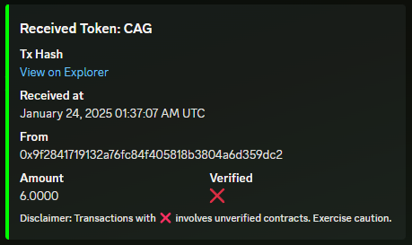
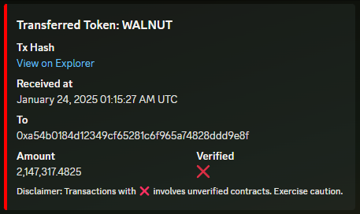
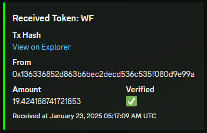
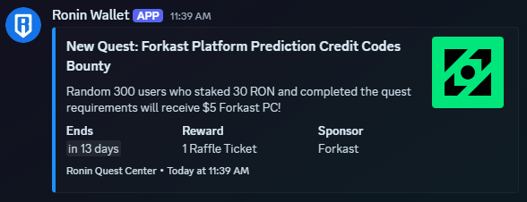

# Ronin Wallet Tracker

This Python script monitors a specific Ronin wallet for incoming and outgoing ERC-20 token transfers, and also checks for new quests on the Ronin Quest Center. It sends notifications to a Discord channel when new transactions or quests are detected. The script uses the [Moralis API](https://moralis.io/) to fetch the latest transactions, the [Ronin Quest Center API](https://wallet-manager.skymavis.com/) for quest updates, and the [Discord Webhook API](https://discord.com/developers/docs/resources/webhook) to send notifications.

## Features

### Wallet Transaction Monitoring
- Monitors a specified Ronin wallet for both incoming and outgoing ERC-20 token transfers
- Sends Discord notifications when new transactions are detected
- Transaction notifications include:
  - Token symbol
  - Transaction hash
  - Sender or recipient address
  - Amount transferred (formatted with commas and up to 4 decimal places)
  - Contract verification status (verified ✅ or unverified ❌)
- Tracks up to the last 20 transactions to detect new activity





### Quest Monitoring
- Automatically checks for new quests on the Ronin Quest Center
- Sends Discord notifications for newly discovered quests
- Quest notifications include:
  - Quest name and description
  - Quest logo thumbnail
  - End time (displayed as Discord timestamp)
  - Rewards information (amount and symbol)
  - Sponsor name (if available)
- Checks for new quests once every 24 hours




### How It Works

The script runs two concurrent monitoring tasks:

1. **Transaction Monitoring**: Checks the specified Ronin wallet for new transactions every 108 seconds
2. **Quest Monitoring**: Checks for new quests on the Ronin Quest Center every 24 hours

The transaction monitoring interval is calculated based on Moralis API free-tier limits:

- **Moralis Free Tier**: Users are allocated 40,000 Compute Units (CU) daily
- **API Cost**: Each `erc20/transfers` call consumes 50 CU
- **Calculation**:  
  - Daily API requests allowed: 40,000 / 50 = 800 requests/day
  - Time between requests to stay within the limit: (24 * 60 * 60) / 800 = approx. 108 seconds

The quest monitoring uses a separate timer and checks once per day to avoid unnecessary API calls since quests typically don't change frequently.

## Purpose

The Ronin Mobile Wallet application only supports notifications for a single address. This script was created to monitor additional addresses and to track newly available quests that might offer rewards or airdrops. With the recent release of Tama.Meme and other tokens, it's important to stay updated on:

1. Incoming token transfers (potential airdrops)
2. Outgoing transfers from your wallet
3. New quests that could provide rewards

This script is designed to track a single wallet efficiently while also monitoring for new quest opportunities. If you need to monitor multiple wallets, be aware that each additional wallet increases the number of API calls. To stay within the free-tier limit, you must either:

1. **Adjust the interval**: Increase the interval between checks proportionally to account for the additional calls
2. **Use another API key**: Obtain an additional Moralis API key to distribute the load

For example, tracking two wallets would require doubling the interval to approximately 216 seconds, assuming the same API usage and free-tier allowance.

## Requirements

- Python 3.7 or higher
- Required Python packages:
  - `aiohttp`
  - `discord-webhook`
  - `python-dotenv`

You can install the required packages by running:

```bash
pip install -r requirements.txt
```

### Using a Virtual Environment (Optional)

To keep dependencies isolated, it's recommended to create a virtual environment.

1. Create a virtual environment named `rwt-venv` in the project directory:

    ```bash
    python3 -m venv rwt-venv
    ```

2. Activate the virtual environment:

    ```bash
    source rwt-venv/bin/activate
    ```

3. Install the required dependencies:

    ```bash
    pip install -r requirements.txt
    ```

4. When done, you can deactivate the virtual environment using:

    ```bash
    deactivate
    ```

If you no longer need the virtual environment, you can remove it by deleting the `rwt-venv` folder:

```bash
rm -rf rwt-venv
```

## Setup

1. Clone this repository to your local machine:

   ```bash
   git clone https://github.com/komiwalnut/ronin-wallet-tracker.git
   cd ronin-wallet-tracker
   ```

2. Create a .env file in the project root and add the following variables:

    ```bash
    MORALIS=moralis_api_key
    WEBHOOK=discord_webhook_url
    ADDRESS=ronin_wallet_address
    ```

3. Run the script

    ```bash
    python main.py
    ```
    
    Note: The script will create a `data` directory to cache transaction hashes and quest information. This prevents duplicate notifications.

    I recommend running this script on a cloud server to ensure it operates continuously without interruptions. If you plan to do the same, ensure your server supports Python 3.7 or higher and has the required dependencies installed.

### PM2 Setup for Autostart

To ensure the script runs continuously and restarts automatically after server reboots, you can use **PM2**:

1. Install PM2 globally:

   ```bash
   npm install -g pm2
   ```

2. Start the script using PM2:
    
    ```bash
    pm2 start ecosystem.config.js
    ```

3. Save the PM2 process list to ensure it starts on system reboot:

   ```bash
    pm2 save
   ```

4. Configure PM2 to start on system boot:

   ```bash
    pm2 startup
   ```

## Cache Files

The script creates two cache files in the `data` directory:

- `transactions.json`: Stores the last 100 transaction hashes to prevent duplicate notifications
- `quests.json`: Stores known quest IDs and the last check timestamp to track new quests

These files are automatically managed by the script and should not be manually edited.

## Discord Notification Examples

### Transaction Notifications
- **Received tokens**: Green embed with sender address and amount
- **Transferred tokens**: Red embed with recipient address and amount
- Both include transaction hash link, timestamp, and verification status

### Quest Notifications
- Blue embed with quest name and description
- Shows rewards, end time (as Discord timestamp), and sponsor information
- Includes quest logo as thumbnail when available
